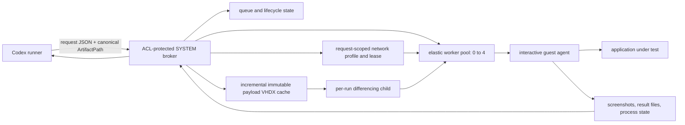

# Architecture

The runner submits but never assumes that queue claim means application launch. The broker publishes atomic request-state transitions for submission, queue depth, worker assignment, payload staging, VM preparation/startup, guest-agent readiness, launch, confirmed application process state, action progress, evidence collection, recycling, cancellation, and terminal result.

An explicitly requested named physical-host test routes to computer use. The harness runs application tests only inside disposable guests and contains no physical-desktop controller. Its host-side SYSTEM broker remains responsible for VM orchestration.

The elastic pool starts at zero. Leasing a worker causes the broker to prepare one additional spare when capacity remains. A ready spare is retained while any worker is leased, and released workers recycle asynchronously. Each ready worker independently shuts down ten minutes after its last release, producing the intended `0→1→2→3→4→3→2→1→0` shape under load and idle decay.

Payload files remain at the caller's `ArtifactPath`. The broker uses cheap metadata to identify likely changes and hashes only candidates, synchronizes additions/changes/deletions into an immutable VHDX cache, then attaches a new differencing child to the leased worker. Cleanup detaches and deletes that child. Ordinary build outputs and project locations are untouched.

Large external fixture trees may be exposed for one request through the broker's read-only host-input transport instead of becoming payload copies. The mapping is scoped to the request and removed during cleanup.

## Intentional guest power-off

The default request path assumes the guest agent remains reachable through evidence collection. A request may opt into the separate `ExpectGuestPowerOff` contract when the application is expected to atomically write a required marker below `{OUTDIR}` and then power off the disposable guest. The broker accepts the contract only after the guest agent has confirmed the application PID, the host has sampled the VM as `Running` in that application era, and the host later observes `Off` before its cleanup boundary. This ordered host observation is not cryptographic or in-guest proof of which process requested shutdown; attributing it to the application assumes an exclusively owned harness worker with no external administrator intervention. The worker's final `Off` state cannot substitute for the ordered observation because normal cleanup also powers it off.

For the exact opt-in path, the broker closes its parent guest session, writes the durable ambiguity/no-replay state, and gives exactly one bounded child process ownership of job submission. Killable child processes perform later read-only monitoring probes so cancellation and the execution deadline remain authoritative even if PowerShell Direct hangs. Guest live capture is unavailable under this contract. Once submission may have occurred, the harness never resubmits the job or relaunches the application.

An accepted power-off ends the application execution phase and starts a separate recovery deadline of 30 to 600 seconds, 180 by default. Before recovery, the broker removes request networking and any ephemeral host-input share and verifies that no VM adapter is connected. It then boots the same disposable OS child once without networking. Guest startup recognizes the already-submitted power-off job, preserves its output directory, evaluates the persisted marker, and completes the job without moving it back to the inbox, starting the executable, or replaying its actions. A present marker is accepted only when its last-write time predates the recovery boot. Each recovery copy uses unique private guest and host stages and is accepted only when source length and write time remain stable across copying and the source and destination SHA-256 values match. These application-controlled files and timestamps are application test evidence, not a hostile-guest security attestation. The broker stops the worker, removes the payload child, and leaves asynchronous clean-worker recreation unchanged.

The result model keeps infrastructure and application truth separate. A successful ordered contract observation, marker recovery, and cleanup yield `HarnessSucceeded=true`; marker presence or its optional paired JSON assertion yields `TestEvaluated=true` and the corresponding `TestPassed` value. A missing, empty, or false marker is therefore an application test failure when recovery worked, while premature or unqualified power-off, recovery timeout, relaunch risk, or cleanup failure is a harness failure. Requests without the exact opt-in fields retain the pre-existing lifecycle and timeout behavior.

## Request-scoped network profiles

Browser-faithful pure web tests should stay in a browser. Hyper-V is the boundary for native shell, tray, installer, WebView2, Windows-integration, or network-policy tests.

`None` is the default profile and retains the existing `RunGuestJob` operation. Every non-`None` request uses `RunGuestJobNetworkV1`; this makes an older broker fail closed at operation validation instead of ignoring a newer JSON field. The other names are `IsolatedTestNet` for an explicit cohort on an installation-scoped private VM-only switch, `InternetOnly` for a pinned internal switch and the host's sole mapping-free WinNAT, and `TrustedLan` for an external switch pinned through its logical and physical identity with full LAN exposure. `InternetOnly` and `TrustedLan` remain disabled until their host configuration is separately approved and installed.

`InternetOnly` uses two independent enforcement layers. Hyper-V private VLANs place every request adapter in `Isolated` mode and the sole host gateway adapter in `Promiscuous` mode with exact broker-pinned primary and secondary VLAN IDs, so guests cannot exchange Ethernet, ARP, broadcast, or multicast frames with peer guests. The promiscuous host gateway remains reachable for the Ethernet/ARP control traffic required to reach WinNAT; this profile does not claim that the host gateway is invisible at raw layer 2. Weighted extended switch ACLs then give the exact guest IPv4 source only stateful outbound TCP and UDP, place current host routes/addresses plus private, special, and NAT-prefix destinations ahead of those allows, and deny all other inbound and outbound IP traffic. Basic port ACLs are required to be empty so undocumented MAC-versus-IP precedence is not part of the boundary.

The runner may send only the profile name, an applicable isolated cohort, and the explicit host-input coexistence flag. The SYSTEM broker resolves all switch identity from private configuration and rejects arbitrary switch, NAT, DNS, route, or firewall settings. Enabled `TrustedLan` policy must contain exactly one fully pinned external switch. A shared host input is incompatible with general networking: explicit `Share` is rejected, while `Auto` is resolved to an immutable VHDX when coexistence was explicitly allowed.

For an authorized request, the broker records a per-request adapter lease in a SYSTEM/Administrators-only directory before VM-adapter mutation, creates and secures the adapter while it is disconnected, waits for the guest control channel, revalidates the approved switch/NAT/uplink, VLAN, ACL, and host-route boundary, then connects. Exact guest-visible state is attested before application launch and mutable host policy is rechecked during long runs. Cancellation, timeout, worker failure, broker restart, and normal completion all converge on the same cleanup: bind mutations to recorded VM/switch IDs, disconnect first, remove request-created state, verify every adapter is disconnected and the lease is deleted, and only then publish terminal evidence. Startup and periodic orphan reconciliation use the persisted lease and installation-scoped managed-switch ownership marker to finish interrupted cleanup; an unreadable or ambiguous authoritative inventory stops request processing instead of being treated as empty.

## Baseline servicing and recovery provenance

Ordinary workers never receive durable operating-system updates: their differencing disks are disposable descendants of one immutable pool base. Durable Windows or .NET maintenance therefore services the canonical baseline first. Only that baseline receives temporary outbound connectivity through an explicitly selected Hyper-V switch; it is disconnected and shut down before a candidate checkpoint is created.

The candidate becomes a versioned immutable pool base. Worker registrations are then replaced and boot-verified sequentially, with the prior registration retained until each new worker proves the Windows build, SDK manifest, interactive agent, clean shutdown, and disconnected network. The canonical checkpoint and pool definition are promoted only after all workers pass.

The local recovery bundle exports the exact verified baseline and installed source. GitHub stores only the rebuild and servicing logic, so a cold rebuild resolves then-current official Windows media, approved non-preview updates, and the reviewed stable .NET SDK rather than reproducing a byte-identical historical image.
