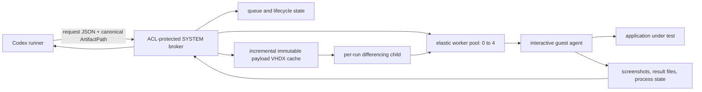

# Architecture

The runner submits but never assumes that queue claim means application launch. The broker publishes atomic request-state transitions for submission, queue depth, worker assignment, payload staging, VM preparation/startup, guest-agent readiness, launch, confirmed application process state, action progress, evidence collection, recycling, cancellation, and terminal result.

The elastic pool starts at zero. Leasing a worker causes the broker to prepare one additional spare when capacity remains. A ready spare is retained while any worker is leased, and released workers recycle asynchronously. Each ready worker independently shuts down ten minutes after its last release, producing the intended `0→1→2→3→4→3→2→1→0` shape under load and idle decay.

Payload files remain at the caller's `ArtifactPath`. The broker uses cheap metadata to identify likely changes and hashes only candidates, synchronizes additions/changes/deletions into an immutable VHDX cache, then attaches a new differencing child to the leased worker. Cleanup detaches and deletes that child. Ordinary build outputs and project locations are untouched.

Large external fixture trees may be exposed for one request through the broker's read-only host-input transport instead of becoming payload copies. The mapping is scoped to the request and removed during cleanup.

## Baseline servicing and recovery provenance

Ordinary workers never receive durable operating-system updates: their differencing disks are disposable descendants of one immutable pool base. Durable Windows or .NET maintenance therefore services the canonical baseline first. Only that baseline receives temporary outbound connectivity through an explicitly selected Hyper-V switch; it is disconnected and shut down before a candidate checkpoint is created.

The candidate becomes a versioned immutable pool base. Worker registrations are then replaced and boot-verified sequentially, with the prior registration retained until each new worker proves the Windows build, SDK manifest, interactive agent, clean shutdown, and disconnected network. The canonical checkpoint and pool definition are promoted only after all workers pass.

The local recovery bundle exports the exact verified baseline and installed source. GitHub stores only the rebuild and servicing logic, so a cold rebuild resolves then-current official Windows media, approved non-preview updates, and the reviewed stable .NET SDK rather than reproducing a byte-identical historical image.
